

<h1 style="font-size: 4em; margin-bottom: 8px; text-transform: uppercase; letter-spacing: 3px; font-family: 'Arial Black', sans-serif;">
<a href="#" style="text-decoration: none;">
&#x1F680; 
DIGITAL EXAMINATION SYSTEM  </a>   
  
(DES) &#x1F393;🔥
</a>
</h1>

The Ultimate Assessment Deployment Platform for Secure & Granular EdTech Evaluation! 🚀✨

"https://anjha-101-timen.github.io/Digital_Examination_System/" 

<!-- CORRECTED: Set functional href and fixed the shields.io src URL -->

SECURE. SCALABLE. SMARTER. 💡🌟

<h2 style="font-size: 2.2em; color: #008080; font-weight: bold; border-left: 10px solid #00FFFF; padding-left: 15px; background-color: #e0f7fa; border-radius: 5px;">
&#x1F4C1; PROJECT OVERVIEW: The <i style="color: #FF6347;">Assessment Lifecycle</i> 🎯
</h2>

The <b style="color: #8A2BE2; font-size: 1.3em; text-transform: uppercase;">Digital Examination System (DES)</b> is a <i style="color: #FF00FF;">🔥 absolutely robust EdTech solution</i> designed to manage the <u style="color: #4169E1;">entire Assessment Lifecycle</u> from resource creation to data decommissioning. It provides administrators with GRANULAR CONTROL over exam configuration parameters and offers students a <b style="font-size: 1.2em; color: #006400;">low-latency, responsive assessment interface.</b> The system architecture prioritizes <i style="color: #00A388;">data integrity</i> and supports complex pedagogical requirements for modern education. ✅

<h2 style="font-size: 2.2em; color: #800080; font-weight: bold; border-left: 10px solid #DDA0DD; padding-left: 15px; background-color: #f3e5f5; border-radius: 5px;">
&#x1F4DA; TECHNICAL FEATURE ANALYSIS & WORKFLOW (IMAGES 1-30 DETAILED) ⚙️📊
</h2>

This section provides a <i style="color: #4B0082;">detailed analysis</i> of the system's functional specifications and administrative workflow, referencing the sequential image captures. 👇 Scroll down to see the magic!

<ol style="font-size: 1.15em; line-height: 1.8; list-style-type: none; padding-left: 0;">
<li style="margin-bottom: 30px; border-bottom: 2px dotted #B0C4DE; padding-bottom: 15px;">
 (Create Panel): 🔥 Resource Provisioning Starts! 🚀
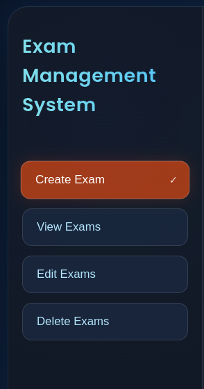

The Exam Resource Provisioning starts here, kicking off the Assessment Creation Workflow. 🚀 This panel is the main entry point for defining a new digital exam within the EdTech system.

</li>

<li style="margin-bottom: 30px; border-bottom: 2px dotted #B0C4DE; padding-bottom: 15px;">
 (Metadata Input): Key Data Capture. 🏷️
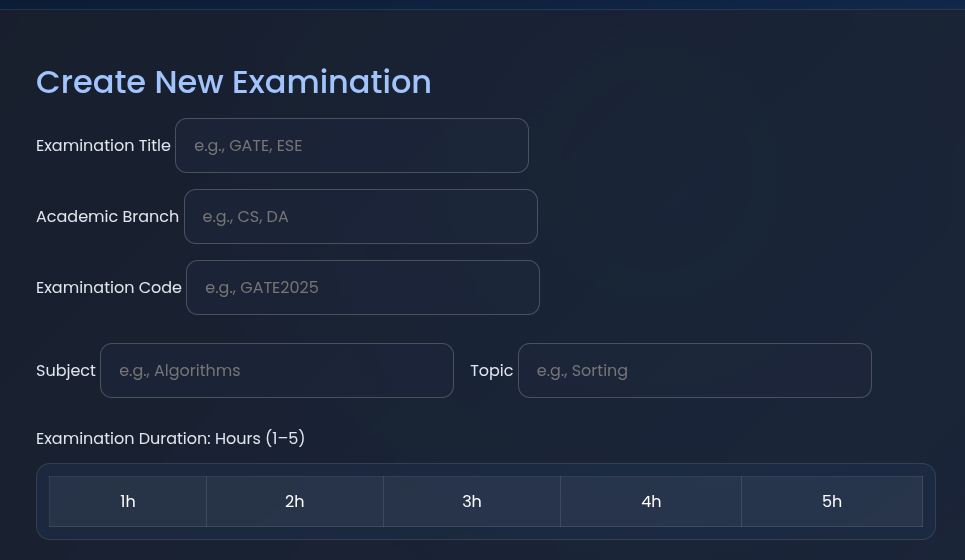

We capture key Assessment Metadata, like the Exam Title and the unique Course/Branch Code. This is where we set the <b style="color: #FFA500;">Time-Box Constraint,</b> which is vital for student time management and proctoring.

</li>

<li style="margin-bottom: 30px; border-bottom: 2px dotted #B0C4DE; padding-bottom: 15px;">
 (Duration Fine-Tuning): Precision Timing! ⏱️
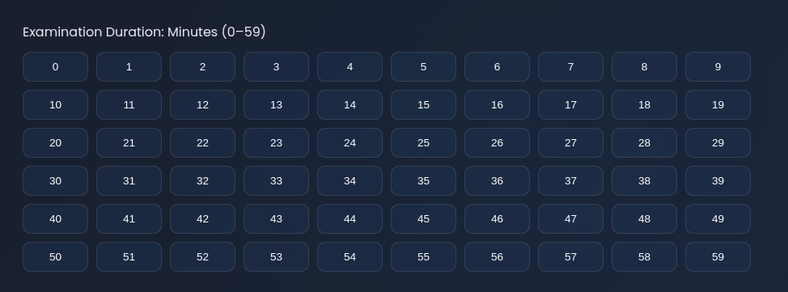

The system asks for the exact total Temporal Configuration for the assessment in minutes. This precision lets administrators set <b style="color: #DC143C;">strict rules</b> for session time limits.

</li>

<li style="margin-bottom: 30px; border-bottom: 2px dotted #B0C4DE; padding-bottom: 15px;">
 (Total Questions): Inventory Count. 🔢
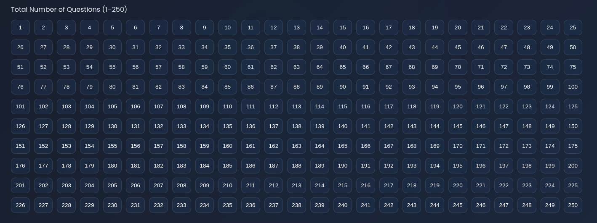

The <b style="color: #483D8B;">Total Question Inventory Count</b> determines the size and scope of the digital exam. An accurate count is necessary for resource indexing.

</li>

<li style="margin-bottom: 30px; border-bottom: 2px dotted #B0C4DE; padding-bottom: 15px;">
 (Time Per Question): Granular Control! ⏳
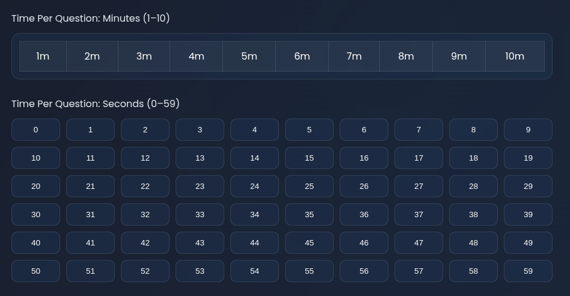

This function allows Granular Timing Controls, setting the time a student can spend on each item. It supports advanced <b style="color: #00FF7F;">Pedagogical Design.</b>

</li>

<li style="margin-bottom: 30px; border-bottom: 2px dotted #B0C4DE; padding-bottom: 15px;">
 (Scoring & Scheduling): Launch Parameters Set! ⭐
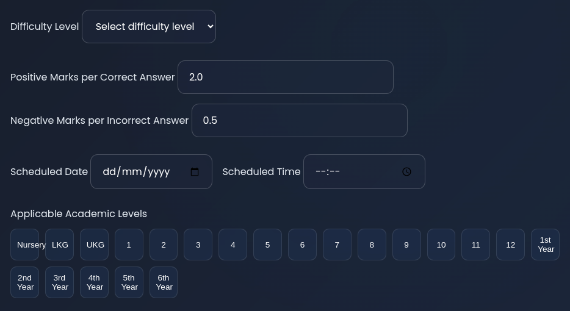

This screen manages the Scoring Schema and sets the Difficulty Level. Crucial for <b style="color: #FFA07A;">Asynchronous Deployment.</b> "A goal without a plan is just a wish." 🎯

</li>

<li style="margin-bottom: 30px; border-bottom: 2px dotted #B0C4DE; padding-bottom: 15px;">
 (Academic Mapping): Cohort Alignment. 📚
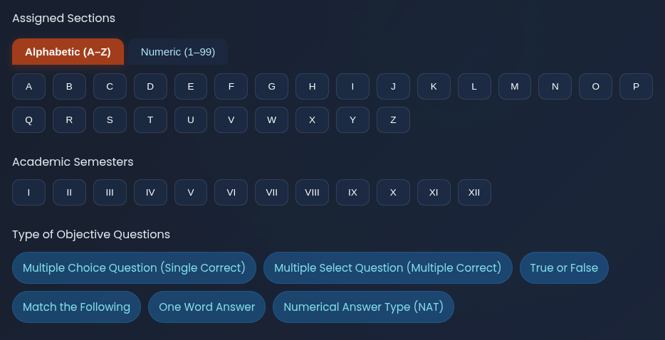

Dropdown menus ensure accurate Academic Mapping to specific Sections and Semesters. Proper mapping prevents mistakes and ensures accurate reporting.

</li>

<li style="margin-bottom: 30px; border-bottom: 2px dotted #B0C4DE; padding-bottom: 15px;">
 (Format Specification): Security Boost! 📝
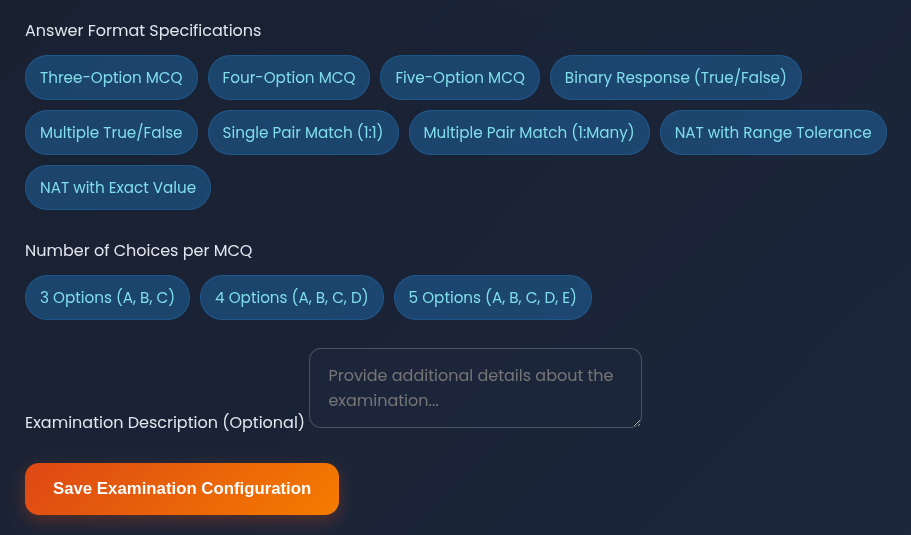

Here we define the Question Format (e.g., MCQ, MSQ) and how items are selected. <b style="color: #FF8C00;">Randomization</b> is key for boosting assessment security! 🔒

</li>

<li style="margin-bottom: 30px; border-bottom: 2px dotted #B0C4DE; padding-bottom: 15px;">
 (Read Panel): Inventory Overview. 📋
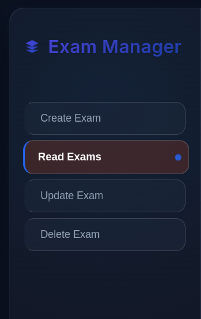

The "Read" panel gives the Assessment Inventory Overview, showing a master list of all configured exams. This is the main <b style="color: #00CED1;">Resource Management Module.</b> 👀

</li>

<li style="margin-bottom: 30px; border-bottom: 2px dotted #B0C4DE; padding-bottom: 15px;">
 (Exam Data Grid): Real-Time Status! ⚙️
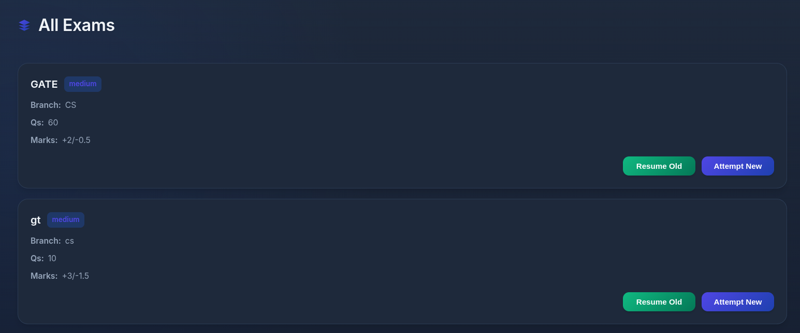

The Exam Inventory Data Grid shows detailed data, including Status, Title, and ID. Features links for immediate <b style="color: #FF4500;">CRUD Actions (Edit/Delete).</b> "Visibility is key to control."

</li>

<li style="margin-bottom: 30px; border-bottom: 2px dotted #B0C4DE; padding-bottom: 15px;">
 (Authoring Interface): Content Creation Hub! ✍️
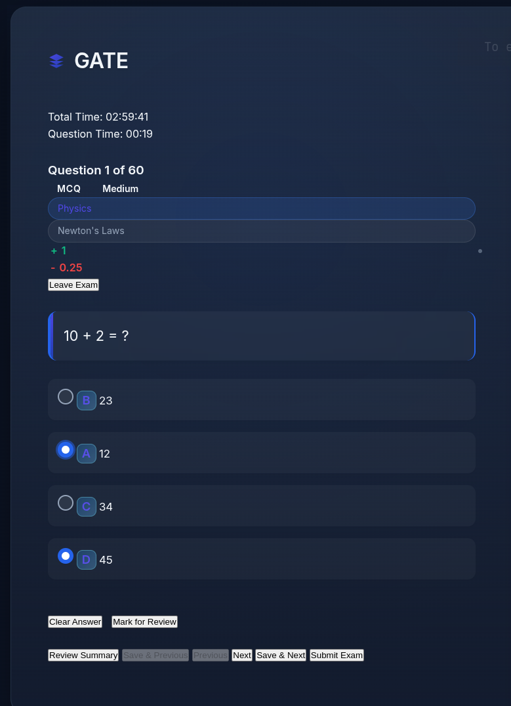
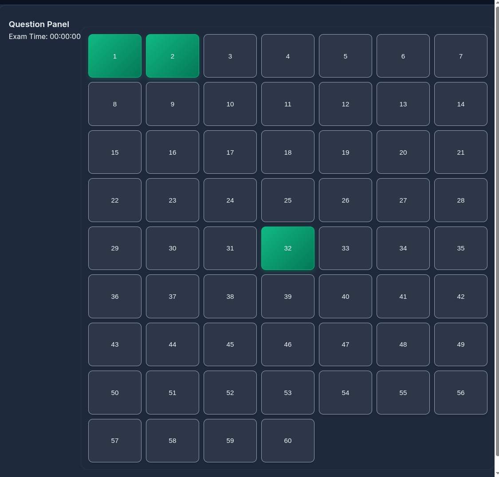

Accessing the Rich-Text Authoring Tool to create high-quality, reusable Assessment Items. This module is the <b style="color: #8A2BE2;">heart of the Question Bank Management System.</b>

</li>

<li style="margin-bottom: 30px; border-bottom: 2px dotted #B0C4DE; padding-bottom: 15px;">
 (Edit Panel): Mutation Protocol Init! 🛠️
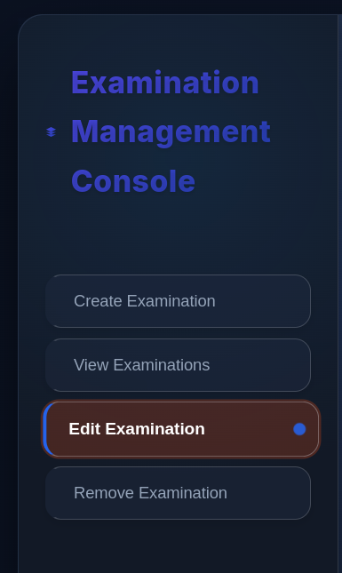

The "Edit Exam Panel" starts the <u style="color: #FFA500;">Resource Mutation Process</u> to change assessment parameters. Allows for necessary <b style="color: #FF8C00;">Change Control.</b>

</li>

<li style="margin-bottom: 30px; border-bottom: 2px dotted #B0C4DE; padding-bottom: 15px;">
 (Modify Selection): Targeted Changes. 📝
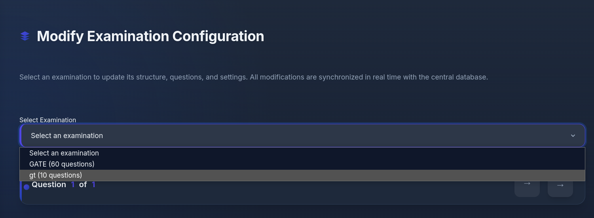

This view gives a Selective Parameter Modification List, limiting changes to specific fields. This design choice enforces strict <b style="color: #191970;">Data Governance.</b>

</li>

<li style="margin-bottom: 30px; border-bottom: 2px dotted #B0C4DE; padding-bottom: 15px;">
 (Exam Modify Options): Full Flexibility! ✅
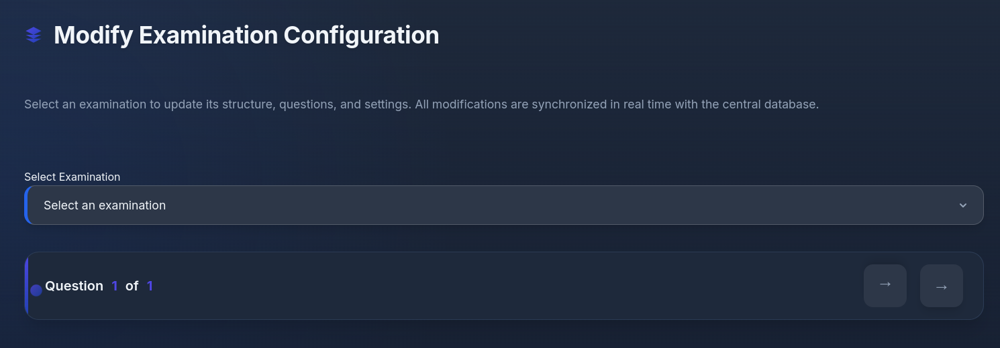

The Configuration Adjustment Taxonomy shows all parameters that can be changed <b style="color: #3CB371;">dynamically.</b> Ensures full flexibility in managing a deployed assessment.

</li>

<li style="margin-bottom: 30px; border-bottom: 2px dotted #B0C4DE; padding-bottom: 15px;">
 (Credential Gatekeeper): Maximum Security! 🔒
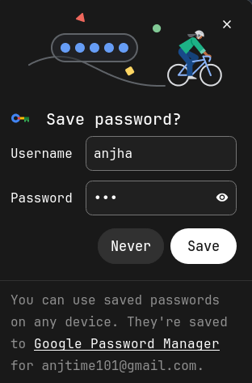

A High-Security Credential Gatekeeper demands re-authentication before sensitive changes. This provides an extra layer of <u style="color: #B22222;">Access Control Validation.</u> "Security is not a product, but a process."

</li>

<li style="margin-bottom: 30px; border-bottom: 2px dotted #B0C4DE; padding-bottom: 15px;">
 (RBAC Authorization): Permission Check. ✅
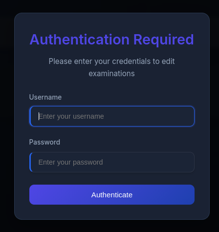

An explicit Authentication & Authorization prompt checks the user's <b style="color: #DAA520;">Role-Based Access Control (RBAC)</b> permissions. Essential for system integrity!

</li>

<li style="margin-bottom: 30px; border-bottom: 2px dotted #B0C4DE; padding-bottom: 15px;">
 (Question Type Selector): Answer Key Definition. 🔑
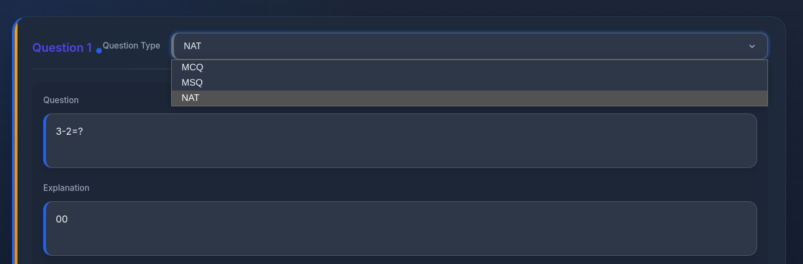

This selection defines the specific Answer Key Type. Setting this correctly is vital for achieving high <b style="color: #BA55D3;">Assessment Reliability.</b>

</li>

<li style="margin-bottom: 30px; border-bottom: 2px dotted #B0C4DE; padding-bottom: 15px;">
 (Pedagogical Feedback): Learning Opportunity! 💡
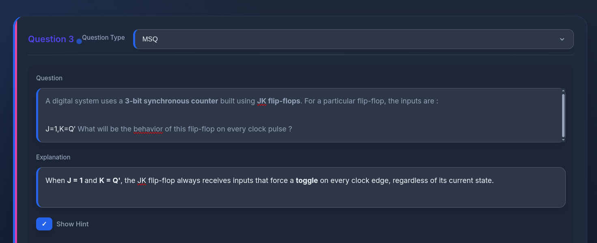

A dedicated field allows documenting a detailed Solution Explanation or <b style="color: #C71585;">Remedial Feedback.</b> Core element of the system's <u style="color: #FF69B4;">Pedagogical Support.</u>

</li>

<li style="margin-bottom: 30px; border-bottom: 2px dotted #B0C4DE; padding-bottom: 15px;">
 (Metadata Tagging): Resource Classification. 🏷️
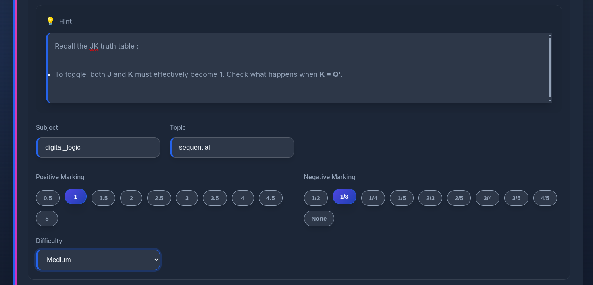

Metadata Tags are applied for detailed resource classification. They are the building blocks for creating personalized <b style="color: #A0522D;">Adaptive Learning Paths.</b>

</li>

<li style="margin-bottom: 30px; border-bottom: 2px dotted #B0C4DE; padding-bottom: 15px;">
 (Solution Key): Scoring Accuracy Assured. 💯
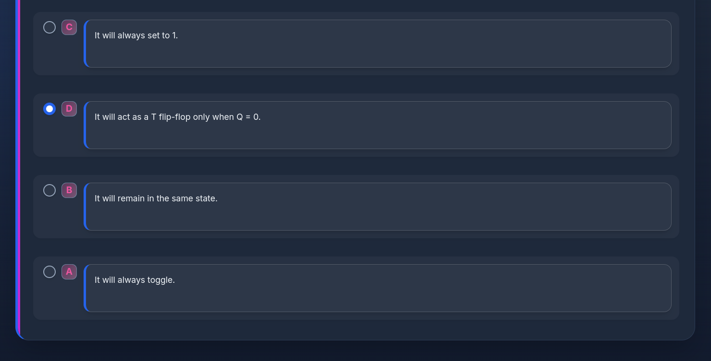

Defining the Correct Solution is necessary for <b style="color: #00FF7F;">Scoring Accuracy.</b> This data is the main input used by the <u style="color: #00FA9A;">Automated Scoring Engine.</u>

</li>

<li style="margin-bottom: 30px; border-bottom: 2px dotted #B0C4DE; padding-bottom: 15px;">
 (Delete Panel): Decommissioning Protocol. 🗑️

The "Delete Exam" panel begins the Resource Decommissioning Protocol. Represents the start of the final, irreversible phase.

</li>

<li style="margin-bottom: 30px; border-bottom: 2px dotted #B0C4DE; padding-bottom: 15px;">
 (Irreversible Warning): STOP! Warning Alert! 🚨
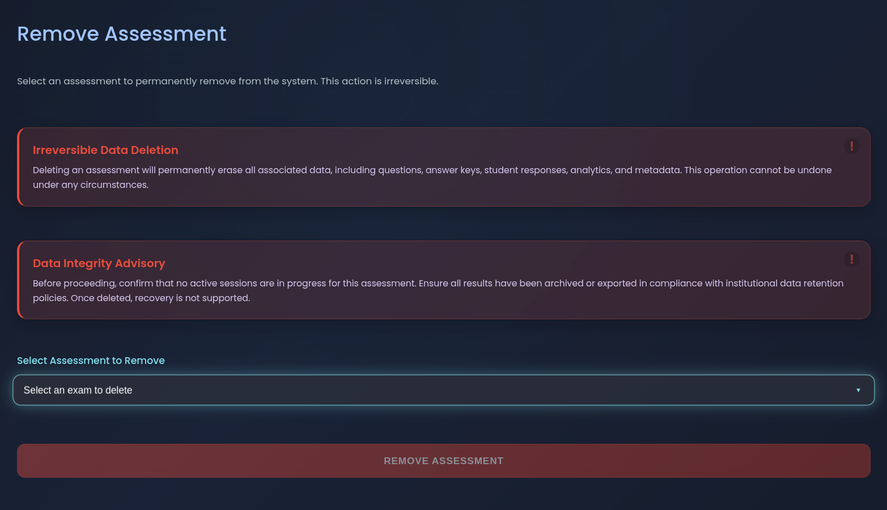

An explicit warning alerts the user to the "irreversible nature" of the transaction. This vital design choice reduces the risk of accidental <b style="color: #FF0000;">Data Destruction.</b> "Measure twice, cut once."

</li>

<li style="margin-bottom: 30px; border-bottom: 2px dotted #B0C4DE; padding-bottom: 15px;">
 (Removal Confirmation): Middle Checkpoint. ✔️
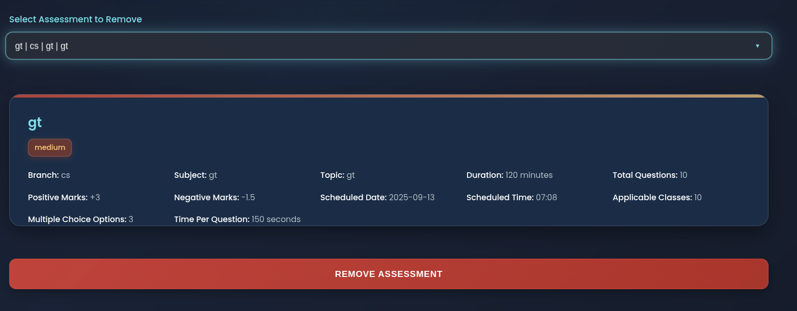

A confirmation step asks for agreement on the removal of the selected Assessment Instance ID. Adds necessary <b style="color: #3CB371;">Operational Friction.</b>

</li>

<li style="margin-bottom: 30px; border-bottom: 2px dotted #B0C4DE; padding-bottom: 15px;">
 (Final Confirmation): THE FINAL BLOW! 💥
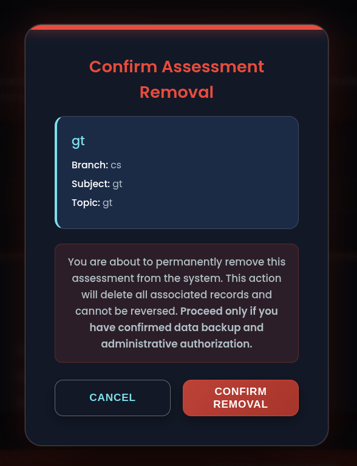

The final, high-friction confirmation needed to execute the <b style="color: #FF4500;">Data Destruction Operation.</b> Ultimate safeguard against deletion errors.

</li>

<li style="margin-bottom: 30px; border-bottom: 2px dotted #B0C4DE; padding-bottom: 15px;">
 (Student Client View): Responsive Magic! 📱
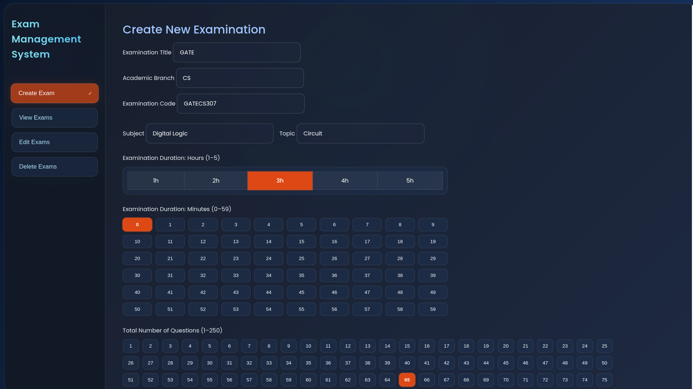
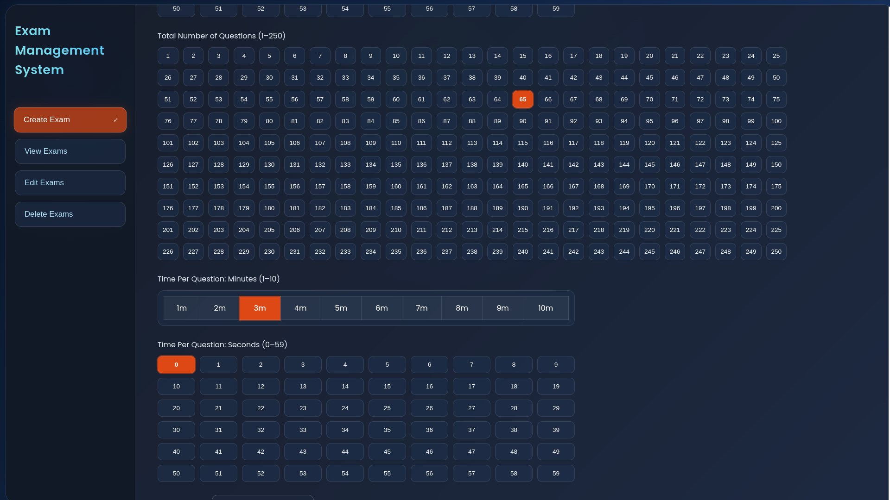
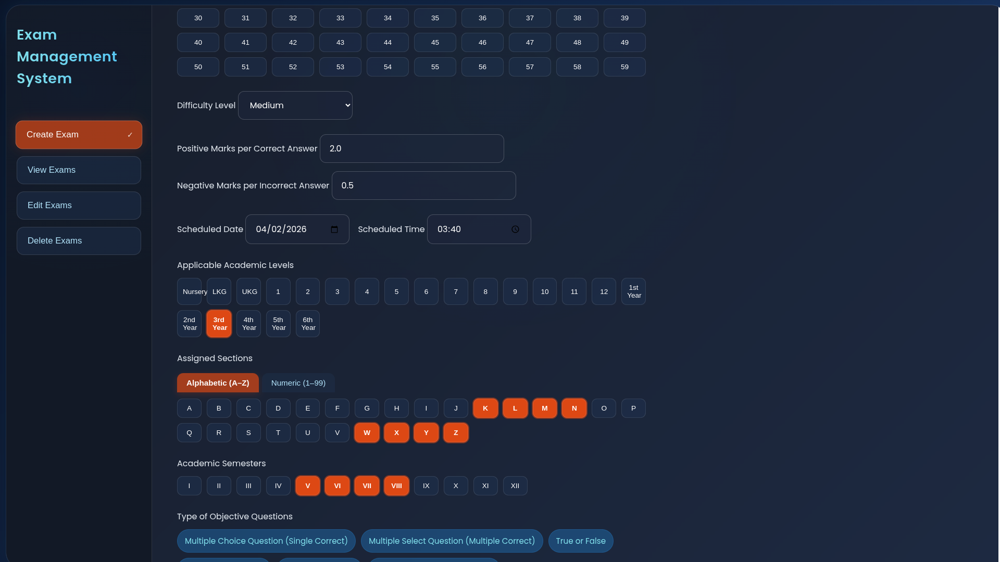
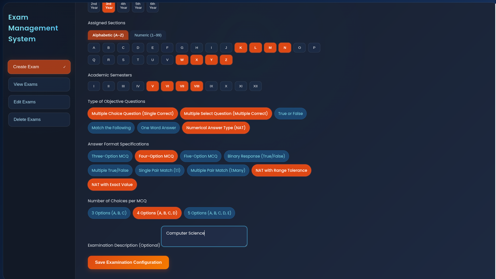
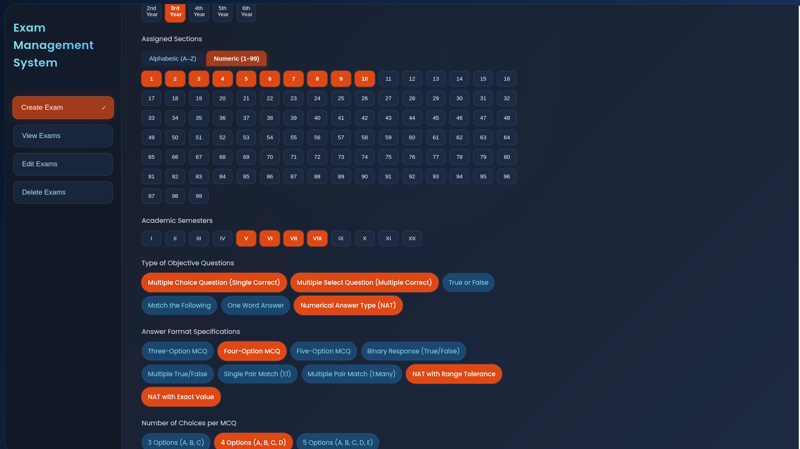

The Student Assessment Interface features a clean, <b style="color: #1E90FF;">Responsive Design</b> for all devices. A prominent <u style="color: #DC143C;">Real-Time Timer</u> enforces integrity. Ensures a smooth and distraction-free testing environment. 💯

</li>

<li style="margin-bottom: 30px; border-bottom: 2px dotted #B0C4DE; padding-bottom: 15px;">
 (List Review): Deployment Control. 🔍
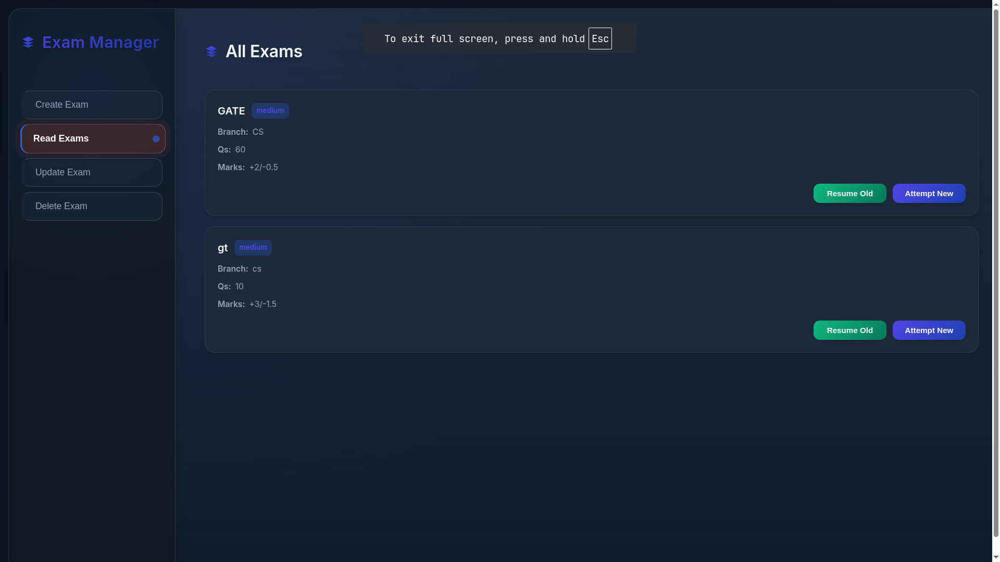

A clear table displays the live status of all deployed exams. Serves as a <b style="color: #DAA520;">high-fidelity Deployment Control Panel.</b> Essential for operational management.

</li>

<li style="margin-bottom: 30px; border-bottom: 2px dotted #B0C4DE; padding-bottom: 15px;">
 (Admin Dashboard): The Central Hub! 📊
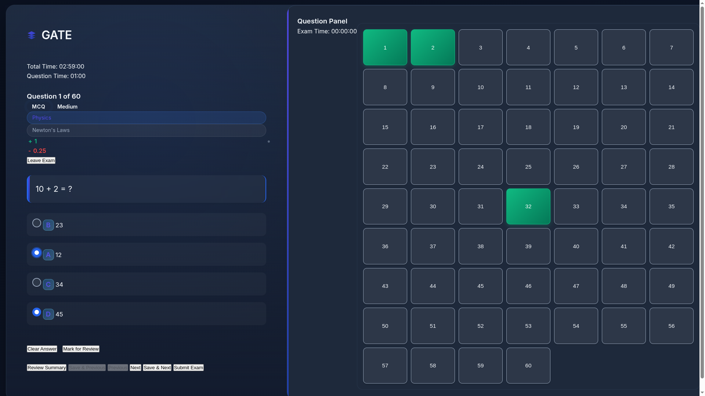

The central System Dashboard is the main entry point. Gives an <b style="color: #3CB371;">Aggregated Operational Overview.</b> Single source of truth for all assessment activity.

</li>

<li style="margin-bottom: 30px; border-bottom: 2px dotted #B0C4DE; padding-bottom: 15px;">
 (Update Commit): Transaction Finalized! 💾
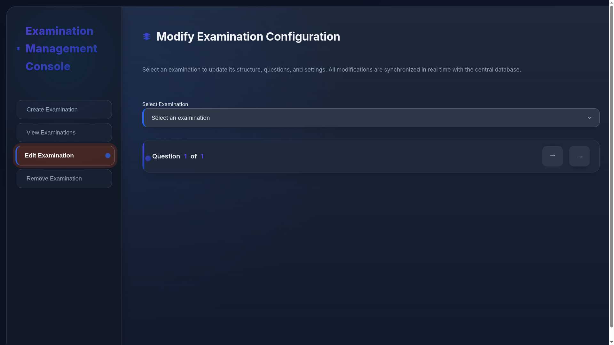

The "Update Exam" button is the final step to commit the Resource Update transaction. Critical point in the system's <b style="color: #FF00FF;">Change Control.</b>

</li>

<li style="margin-bottom: 30px; border-bottom: 2px dotted #B0C4DE; padding-bottom: 15px;">
 (Delete Action): High-Impact Button! 🛑
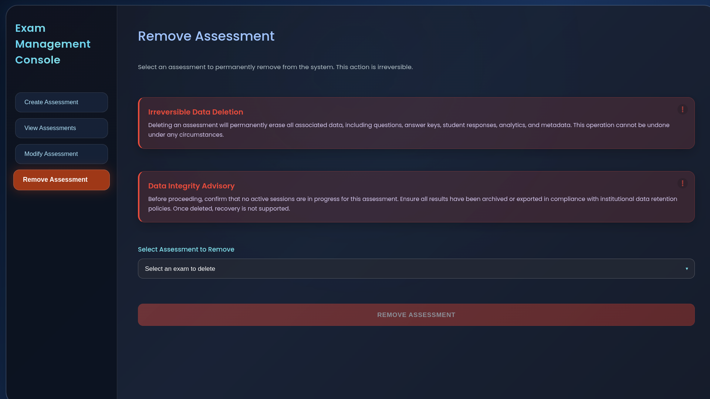

This primary button starts the multi-stage Decommissioning Workflow. Its unique styling highlights its <b style="color: #FF6347;">High-Impact Nature.</b>

</li>

<li style="margin-bottom: 30px; padding-bottom: 15px;">
 (Inferred Reporting): Actionable Insights! 📈

The final stage is Post-Examination Reporting and Data Analytics. Turns raw scores into key <b style="color: #DAA520;">Psychometric Data.</b> Provides actionable insights back to educators. 🧠

</li>
</ol>

<h2 style="font-size: 2.2em; color: #D84315; font-weight: bold; border-left: 10px solid #FF5722; padding-left: 15px; background-color: #fbe9e7; border-radius: 5px;">
&#x26A0; POTENTIAL FUTURE ENHANCEMENTS 🌟
</h2>

The system's robust architecture provides a strong foundation for integrating advanced EdTech capabilities and achieving system nirvana:

<ul style="font-size: 1.2em; line-height: 2.0; list-style-type: '👉 ';">
<li style="color: #4CAF50;">&#x1F4D9; <b style="color: #006400; text-decoration: underline;">Integration of Psychometric Analysis tools</b> for automated question difficulty normalization and item validation. 🔬</li>
<li style="color: #2196F3;">&#x1F5B3; <b style="color: #1976D2; font-style: italic;">Migration towards a Microservices Architecture</b> to ensure scalable execution of high-volume concurrent assessments. 🌐</li>
<li style="color: #FF9800;">&#x1F5C2; <b style="color: #E65100; text-decoration: underline;">Implementation of robust Version Control</b> for tracking historical changes to question content and exam parameters, compliant with audit standards. 📜</li>
</ul>

SYSTEM STATUS: OPTIMAL

A <b style="color: #00FF00;">commitment</b> to high-quality Educational Technology and <u style="color: #FFCC80;">secure digital assessment deployment.</u>

🚀💯🔥

